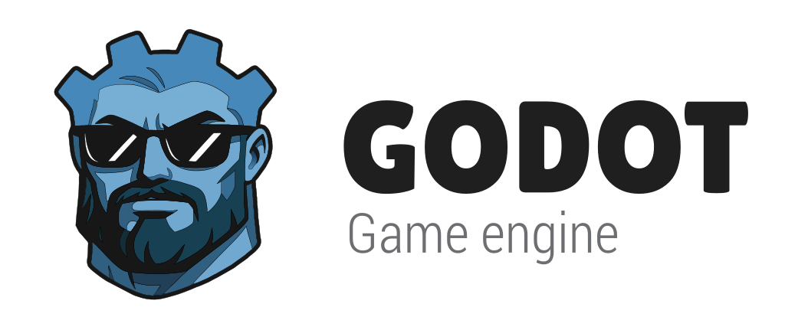
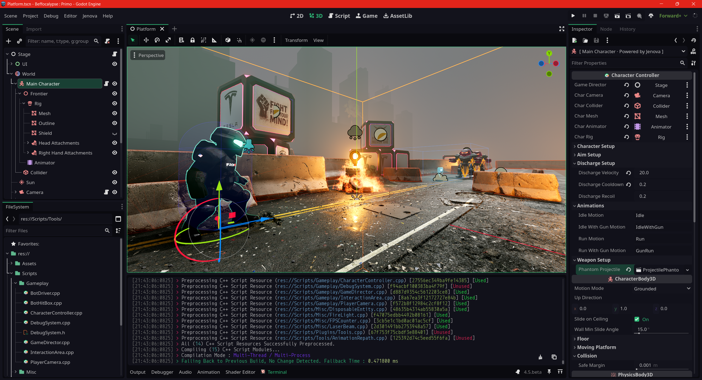

# Godot Engine :: Jenova Compatible

  

A **1:1** fork of [Godot Engine](https://godotengine.org) with added support for **[Jenova Framework](https://github.com/Jenova-Framework) Nested Extensions Hot-Reloading**, While basic hot-reloading works on all Godot forks, Nested Extension (NE) support requires a compatible distribution, this repository is the officially supported **Godot Jenova Compatible** builds, preserving all upstream engine behavior and workflows.

[📚 Read More in the Documentation](https://jenova-framework.github.io/docs/pages/Advanced/Hot-Reload/) 

## 2D and 3D cross-platform game engine

**[Godot Engine](https://godotengine.org) is a feature-packed, cross-platform
game engine to create 2D and 3D games from a unified interface.** It provides a
comprehensive set of [common tools](https://godotengine.org/features), so that users can focus on making games without having to reinvent the wheel. Games can be exported with one click to a number of platforms, including the major desktop platforms (Linux, macOS, Windows), mobile platforms (Android, iOS), as well as Web-based platforms and [consoles](https://docs.godotengine.org/en/latest/tutorials/platform/consoles.html).

## Getting the engine

### Binary downloads

Pre-built binaries for the Godot editor can be found at [GitHub Actions](https://github.com/TheAenema/godot-jenova/actions).

### Compiling from source

[See the official docs](https://docs.godotengine.org/en/latest/contributing/development/compiling) for compilation instructions for every supported platform.
